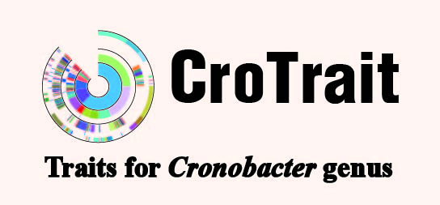

# **CroTrait:** A portable tool for *in silico* species identification, serotyping and multilocus sequence typing of *Cronobacter* genus

## Introduction

This is the homepage of **CroTrait**, a software package that performs efficient inference of species, O serotypes and sequence types (STs) of *Cronobacter*. **CroTrait** was developed by *Lu Wang*. **CroTrait** is called from a directory containing one or multiple genome sequences and each genome sequence should be saved to a separate file in FASTA format. Input files can either be complete genomes or draft genomes. It is able to analyze hundreds of genomes data in a matter of hours on a ordinary PC.   
Moreover, post data analysis and visualization module embedded in **CroTrait** further assist the user in checking and analyzing the data.

## Citation
*Lu Wang, Wenxuan Zhu, Gege Lu, et al.  
A portable tool for *in silico* species identification, serotyping and multilocus sequence typing of *Cronobacter* genus.
***Journal of Clinical Microbiology*** 2021 Feb (submitted)

## Environment set up
**CroTrait** is a program written in **python** and the external software **BLAST+** and **MEGA** need to be installed and configured locally: 

>**[python](https://www.python.org/)** (version 3.8.0)  

>> dependencies  
>> **biopython** (version 1.78 or higher)  
>> **numpy**  
>> **matplotlib**  
>> **pandas**  

>**[MEGA](https://www.megasoftware.net/)** (version X (64-bit)) 

>**[BLAST+](https://blast.ncbi.nlm.nih.gov/)** (version 2.9.0) 

## User guide

> identify species, O serotypes and STs  
>> Assemblies with unknown species  
>> *CroTrait -d directory [-p prefix]*  
>> -p represent the prefix of result file
>> Assemblies with known species (one of the seven species of *Cronobacter*)  
>> *CroTrait -d directory -s species [-p prefix]*  

